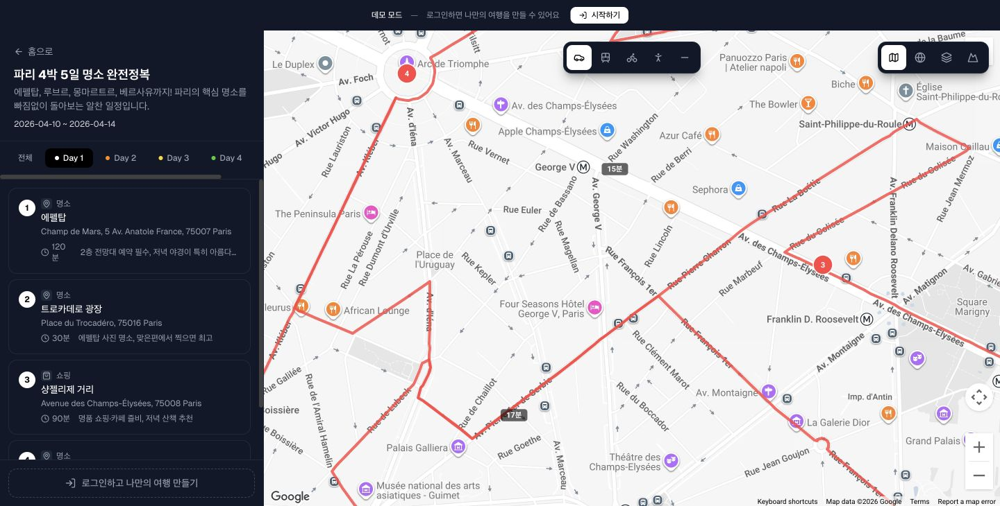
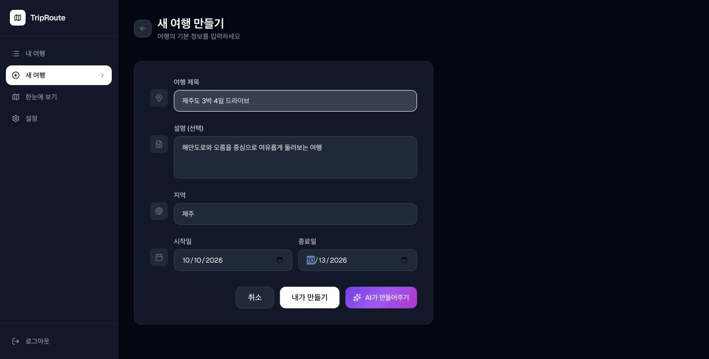
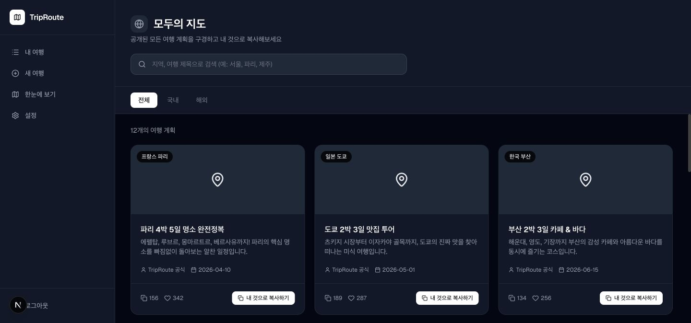

# TripRoute 🗺️
> **"나의 여행? 너의 여행! 우리의 여행."**  
> 내가 만든 동선을 공유하고, 검증된 루트를 그대로 따라가 보세요.

---

## 프로젝트 소개
TripRoute는 여행 동선을 직접 짜고, 다른 사람의 여행 계획을 참고하거나 그대로 복사해서 활용할 수 있는 웹 애플리케이션입니다.  
혼자 여행 계획을 세우는 도구이자, 검증된 여행 루트를 나누는 커뮤니티입니다.

- 개발 기간: 2026년 3월 21일 (1일)
- 개발 환경: MacBook Air 15 M3
- 개발 도구: **Claude Code** (AI 코딩 에이전트 터미널)
- 배포: [https://triproute.vercel.app](https://triproute.vercel.app)

---

## 서비스 둘러보기

### 1. 여행 아이디어 발견하기
첫 화면에서 TripRoute의 핵심 기능을 확인하고, 로그인 없이 바로 시작하거나 데모 여행을 둘러볼 수 있습니다.


### 2. 데모로 여행 동선 확인하기
파리 4박 5일 데모에서 일자별 장소와 이동 경로를 한 화면으로 확인하고, 이동 수단과 지도 레이어를 바꿔볼 수 있습니다.



### 3. 나만의 여행 만들기
여행 제목, 설명, 지역과 날짜를 입력해 직접 일정을 만들거나 AI에게 초안을 요청할 수 있습니다.



### 4. 모두의 여행 계획 둘러보기
공개된 여행 계획을 지역별로 탐색하고, 마음에 드는 일정을 내 여행으로 복사해 활용할 수 있습니다.



---

## 핵심 차별점
- 🗺️ **동선 한눈에 보기** — Google Maps 위에서 여행 루트를 시각적으로 확인
- 📋 **원클릭 복사** — 다른 사람의 여행 계획을 내 것으로 바로 가져오기
- 🏆 **랭킹 시스템** — 복사 횟수 우선, 동률 시 좋아요 수로 지역별 순위 산정

---

## 기술 스택

| 분류 | 기술 |
|------|------|
| Frontend | Next.js 16 (App Router), TypeScript |
| Styling | Tailwind CSS v4, Framer Motion |
| Backend / DB | Supabase (PostgreSQL, RLS, Realtime) |
| 인증 | Supabase Auth (Google OAuth) |
| 지도 | Google Maps JavaScript API, Places API, Directions API |
| 배포 | Vercel |
| 개발 도구 | Claude Code |

---

## 구현 기능

### 🔐 인증
- Google 계정으로 소셜 로그인 (OAuth 2.0)
- 로그인 없이도 모든 기능 사용 가능 (단, 저장 불가)
- 로그인 상태에 따라 Navbar 우측에 프로필 아이콘 / 로그아웃 버튼 표시

### 🗺️ 지도 & 동선
- Google Maps 기반 실시간 동선 시각화
- 이동 수단 선택: 자동차 / 대중교통 / 자전거 / 도보 / 일직선
- 지도 레이어 변경: 기본 / 위성 / 하이브리드 / 지형
- 일자별 색상 구분 (무지개 색 순환: Day1 빨강, Day2 주황, Day3 노랑...)
- 각 Day의 장소끼리만 경로 연결 (다른 Day 간 연결 없음)
- 지도 더블클릭으로 장소 추가 (Geocoding API로 주소 변환)

### 📝 여행 계획
- 여행 생성 / 수정 / 삭제
- 장소 추가 (Google Places Autocomplete 검색)
- 드래그 앤 드롭으로 장소 순서 변경 (Framer Motion Reorder)
- 각 장소별 카테고리 / 메모 / 체류시간 입력
- 일자(Day)별 일정 관리

### 👥 소셜 기능
- 여행 계획 공개 / 비공개 설정
- 다른 사람의 여행 계획 원클릭 복사
- 좋아요 기능
- 지역별 랭킹 (복사 횟수 우선, 좋아요 수 차순)
- 대분류 / 중분류 / 소분류 지역 필터

### 📱 페이지 구성
- **홈** — 랜딩 페이지, 데모 체험 (`/demo`)
- **나의 지도** — 내가 만든 여행 계획 아카이브 (`/my-maps`)
- **최고의 지도** — 지역별 인기 여행 루트 랭킹 (`/best-maps`)
- **한눈에 보기** — 전체 여행을 지도 위에서 한 번에 확인 (`/map`)
- **사용법** — 앱 사용 가이드 애니메이션 (`/how-to-use`)
- **설정** — 계정 설정 (`/settings`)

---

## 개발 과정 — Claude Code 환경 세팅

### Claude Code 설치 및 초기 오류 해결

**① OAuth 토큰 만료 (401 에러)**
```
API Error: 401 - authentication_error: OAuth token has expired.
```
- 원인: Claude Code 로그인 토큰이 만료됨
- 해결: Claude Code 내부에서 `/login` 실행 또는 터미널에서 `claude logout` → `claude` 재실행

**② npm / native 이중 설치 충돌**
```
Warning: Multiple installations found
- npm-global at /opt/homebrew/bin/claude
- native at /Users/mink/.local/bin/claude
```
- 원인: 기존 npm 버전과 새 native 버전이 공존
- 해결:
```bash
npm uninstall -g @anthropic-ai/claude-code
echo 'export PATH="$HOME/.local/bin:$PATH"' >> ~/.zshrc
source ~/.zshrc
```

**③ 설치 방식 설정 불일치**
```
Warning: Running native installation but config install method is 'global'
```
- 해결: `claude install` 실행으로 설정 업데이트 및 자동 업데이트 활성화

> 💡 **핵심 학습:** `claude doctor`는 반드시 Claude Code 바깥(터미널 `%` 프롬프트)에서 실행해야 정상 진단됩니다. Claude Code 채팅창(`>` 프롬프트) 안에서 실행하면 TTY 에러가 납니다.

---

## 난관과 극복 과정

### 1. iCloud 동기화 충돌
- **문제:** 작업 폴더를 `~/Desktop`에 두었더니 iCloud와 동기화되는 문제 발생
- **해결:** `~/Developer_mink/claude_project`로 폴더 이동
```bash
mv ~/Desktop/claude_project ~/Developer_mink/claude_project
```

### 2. Supabase region 컬럼 누락
- **문제:** 여행 생성 시 `Could not find the 'region' column of 'trips' in the schema cache` 에러
- **해결:** Supabase SQL Editor에서 실행
```sql
ALTER TABLE trips ADD COLUMN IF NOT EXISTS region text;
```

### 3. React Hooks 순서 위반
- **문제:** 일자별 색상 구분 기능 추가 후 `Rendered more hooks than during the previous render` 에러
- **원인:** `useMemo` 내부에서 조건부 `return` 사용 (React Hooks 규칙 위반)
- **해결:** 조건부 return 없이 로직 리팩토링

### 4. Google Maps Directions API 제약
- **문제:** 대중교통(TRANSIT) 모드는 경유지 2개 초과 시 에러
```
Exactly two waypoints required in transit requests
```
- **해결:** 장소 3개 이상일 때 구간별 분리 계산 또는 직선 폴백 처리

### 5. 장소 순서 변경 후 동선 꼬임
- **문제:** 드래그로 순서 변경 후 지도 경로가 이전 순서 그대로 유지되는 버그
- **해결:** 순서 변경 이벤트 발생 시 지도 경로 즉시 재계산하도록 수정

### 6. Vercel 배포 후 500 에러
- **문제:** 배포 후 `MIDDLEWARE_INVOCATION_FAILED` 에러
- **원인:** 로컬 `.env.local`의 환경변수가 Vercel에 등록되지 않았음
- **해결:** Vercel 대시보드 → Settings → Environment Variables에 아래 3개 키 등록 후 재배포
  - `NEXT_PUBLIC_SUPABASE_URL`
  - `NEXT_PUBLIC_SUPABASE_ANON_KEY`
  - `NEXT_PUBLIC_GOOGLE_MAPS_API_KEY`

### 7. Google 로그인 후 localhost로 리다이렉트
- **문제:** 배포된 환경에서 Google 로그인 시 localhost로 리다이렉트되어 오류 발생
- **해결:**
  - Supabase → Authentication → URL Configuration → Site URL을 Vercel URL로 변경
  - Redirect URLs에 `https://triproute.vercel.app/**` 추가
  - Google Cloud Console → OAuth 클라이언트 → 승인된 리디렉션 URI에 Supabase 콜백 URL 추가

---

## 로컬 실행 방법

```bash
git clone https://github.com/bighead0831/trip-route.git
cd trip-route
npm install
```

`.env.local` 파일 생성:
```
NEXT_PUBLIC_SUPABASE_URL=your_supabase_url
NEXT_PUBLIC_SUPABASE_ANON_KEY=your_supabase_anon_key
NEXT_PUBLIC_GOOGLE_MAPS_API_KEY=your_google_maps_api_key
```

```bash
npm run dev
```

---

## 회고

이 프로젝트는 Claude Code를 터미널에서 직접 활용하여 **하루 만에 풀스택 웹 애플리케이션을 구축**한 경험이었습니다.

기획 → 환경세팅 → DB 설계 → UI 구현 → 기능 개발 → 배포까지 전 과정을 AI 코딩 에이전트와 함께 진행했습니다. 개발 중 발생하는 에러를 실시간으로 해결하고, 단계별로 승인을 받아 진행하는 방식이 실제 개발 워크플로우와 매우 유사하다는 점이 인상적이었습니다.

Claude Code는 단순히 코드를 작성해주는 것을 넘어, 파일 구조를 직접 생성하고 TypeScript 오류를 스스로 점검하며 최적의 방향을 제안해주는 강력한 개발 파트너였습니다.
